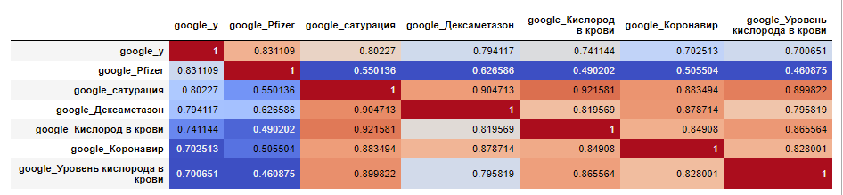
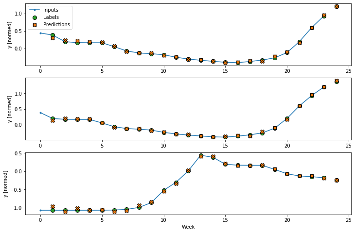
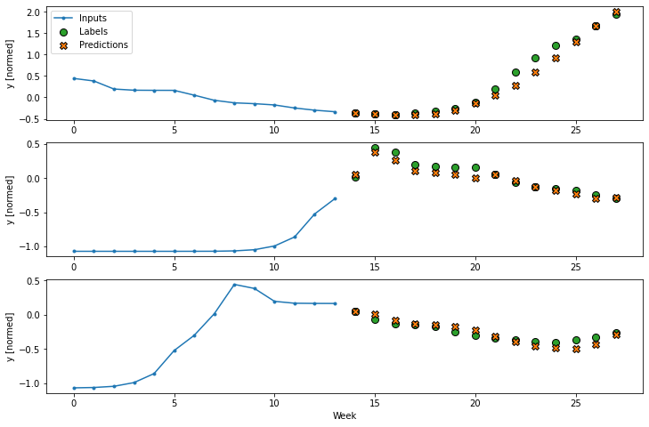

## Аналитическая записка по итогам прохождения учебной практики магистратуры


## “Наука о данных”


## МИСИС, 2021г

Исполнитель: Команда №9 в составе:
Лушпиной Екатерины, 
Моисеева Андрея, 
Озернова Павла, 
Кудрявцева Александра, 
Евсикова Сергея, 
Авдеевой Натальи


Задача на практику предоставлена компанией 

First Line Software

Название задачи: (FLS) Построение модели для анализа распространения COVID-19 на основании открытых данных поисковых систем

Срок проведения: 6 апреля - 31 мая 2021 г.

## Содержание
- [Введение](#%D0%B2%D0%B2%D0%B5%D0%B4%D0%B5%D0%BD%D0%B8%D0%B5)
  * [Исходная гипотеза](#%D0%B8%D1%81%D1%85%D0%BE%D0%B4%D0%BD%D0%B0%D1%8F-%D0%B3%D0%B8%D0%BF%D0%BE%D1%82%D0%B5%D0%B7%D0%B0)
  * [Планируемый объем задач](#%D0%BF%D0%BB%D0%B0%D0%BD%D0%B8%D1%80%D1%83%D0%B5%D0%BC%D1%8B%D0%B9-%D0%BE%D0%B1%D1%8A%D0%B5%D0%BC-%D0%B7%D0%B0%D0%B4%D0%B0%D1%87)
  * [Планируемые результаты](#%D0%BF%D0%BB%D0%B0%D0%BD%D0%B8%D1%80%D1%83%D0%B5%D0%BC%D1%8B%D0%B5-%D1%80%D0%B5%D0%B7%D1%83%D0%BB%D1%8C%D1%82%D0%B0%D1%82%D1%8B)
  * [Критерии оценки результата](#%D0%BA%D1%80%D0%B8%D1%82%D0%B5%D1%80%D0%B8%D0%B8-%D0%BE%D1%86%D0%B5%D0%BD%D0%BA%D0%B8-%D1%80%D0%B5%D0%B7%D1%83%D0%BB%D1%8C%D1%82%D0%B0%D1%82%D0%B0)
  * [Возможности](#%D0%B2%D0%BE%D0%B7%D0%BC%D0%BE%D0%B6%D0%BD%D0%BE%D1%81%D1%82%D0%B8)
- [Процесс решения](#%D0%BF%D1%80%D0%BE%D1%86%D0%B5%D1%81%D1%81-%D1%80%D0%B5%D1%88%D0%B5%D0%BD%D0%B8%D1%8F)
  * [Сбор данных](#%D1%81%D0%B1%D0%BE%D1%80-%D0%B4%D0%B0%D0%BD%D0%BD%D1%8B%D1%85)
  * [Неиспользованные источники и причина отказа от них](#%D0%BD%D0%B5%D0%B8%D1%81%D0%BF%D0%BE%D0%BB%D1%8C%D0%B7%D0%BE%D0%B2%D0%B0%D0%BD%D0%BD%D1%8B%D0%B5-%D0%B8%D1%81%D1%82%D0%BE%D1%87%D0%BD%D0%B8%D0%BA%D0%B8-%D0%B8-%D0%BF%D1%80%D0%B8%D1%87%D0%B8%D0%BD%D0%B0-%D0%BE%D1%82%D0%BA%D0%B0%D0%B7%D0%B0-%D0%BE%D1%82-%D0%BD%D0%B8%D1%85)
  * [Итоговые датасеты по выбранным источникам](#%D0%B8%D1%82%D0%BE%D0%B3%D0%BE%D0%B2%D1%8B%D0%B5-%D0%B4%D0%B0%D1%82%D0%B0%D1%81%D0%B5%D1%82%D1%8B-%D0%BF%D0%BE-%D0%B2%D1%8B%D0%B1%D1%80%D0%B0%D0%BD%D0%BD%D1%8B%D0%BC-%D0%B8%D1%81%D1%82%D0%BE%D1%87%D0%BD%D0%B8%D0%BA%D0%B0%D0%BC)
  * [Обработка собранных данных](#%D0%BE%D0%B1%D1%80%D0%B0%D0%B1%D0%BE%D1%82%D0%BA%D0%B0-%D1%81%D0%BE%D0%B1%D1%80%D0%B0%D0%BD%D0%BD%D1%8B%D1%85-%D0%B4%D0%B0%D0%BD%D0%BD%D1%8B%D1%85)
  * [Нормализация данных](#%D0%BD%D0%BE%D1%80%D0%BC%D0%B0%D0%BB%D0%B8%D0%B7%D0%B0%D1%86%D0%B8%D1%8F-%D0%B4%D0%B0%D0%BD%D0%BD%D1%8B%D1%85)
  * [Анализ данных, построение моделей](#%D0%B0%D0%BD%D0%B0%D0%BB%D0%B8%D0%B7-%D0%B4%D0%B0%D0%BD%D0%BD%D1%8B%D1%85-%D0%BF%D0%BE%D1%81%D1%82%D1%80%D0%BE%D0%B5%D0%BD%D0%B8%D0%B5-%D0%BC%D0%BE%D0%B4%D0%B5%D0%BB%D0%B5%D0%B9)
  * [Проверка полученного подхода к анализу данных](#%D0%BF%D1%80%D0%BE%D0%B2%D0%B5%D1%80%D0%BA%D0%B0-%D0%BF%D0%BE%D0%BB%D1%83%D1%87%D0%B5%D0%BD%D0%BD%D0%BE%D0%B3%D0%BE-%D0%BF%D0%BE%D0%B4%D1%85%D0%BE%D0%B4%D0%B0-%D0%BA-%D0%B0%D0%BD%D0%B0%D0%BB%D0%B8%D0%B7%D1%83-%D0%B4%D0%B0%D0%BD%D0%BD%D1%8B%D1%85)
- [Заключение и выводы](#%D0%B7%D0%B0%D0%BA%D0%BB%D1%8E%D1%87%D0%B5%D0%BD%D0%B8%D0%B5-%D0%B8-%D0%B2%D1%8B%D0%B2%D0%BE%D0%B4%D1%8B)
- [Приложения](#%D0%BF%D1%80%D0%B8%D0%BB%D0%BE%D0%B6%D0%B5%D0%BD%D0%B8%D1%8F)

## Введение

В рамках второго семестра программы магистратуры “Наука о данных” МИСИС 6 апреля - 31 мая 202 1г. проводилась командная учебная практика “Решено” с решением задач, предоставленных партнерами программы. По итогам практики  “Решено” каждая команда должна подготовить отчет о проделанной работе, за который каждый участник получает оценку. 

Данный документ содержит описание основных гипотез, подходов и результаты решения задачи, осуществленной Командой №9 в рамках учебной практики.

Задача предоставлена компанией [First Line Software](https://firstlinesoftware.com/)

Название задачи: Построение модели для анализа распространения COVID-19 на основании открытых данных поисковых систем

Описание задачи представлено на [странице](https://www.notion.so/FLS-COVID-19-3a986f1e67fb4347b07998b7768da938).

### Исходная гипотеза:

По статистике поисковых запросов о коронавирусной пандемии можно отследить динамику  заболеваемости в конкретном регионе (стране, субъекте РФ, и т.д.) и возможность предсказание на будущее. 


### Планируемый объем задач:

* Проанализировать и определить источники данных (поисковые системы, соц.сети), которые будут использованы для анализа;
* Определить критерии выборки запросов (ключевые слова и фразы);
* Собрать данные из открытых источников;
* Сгруппировать данные в несколько этапов: группировка по источникам, а затем объединение в удобный для аналитических запросов вид;
* Проанализировать собранные данные путем их сравнения с официальной статистикой ( Роспотребнадзором, WHO, и другие).

### Планируемые результаты:

* Исходный код в виде [данного github репозитория](https://github.com/ds-misis-team-9/resheno-fls-covid-19)
* Презентация и аналитическая записка с описанием процесса сбора, обработки данных и результатов анализа.

### Критерии оценки результата:

* Подобранные источники данных и критерии соответствуют поставленной задаче.
* Разработанный код соответствует PEP8, документируем.
* Сформулирован аргументированный вывод на основе проведенного анализа.

### Возможности:

* Общая установочная встреча в Zoom.
* Серия личных консультаций с автором кейса и техническим специалистом.
* Разбор результата в Zoom по итогам сданного проекта (обратная связь от заказчика).

## Процесс решения

### Сбор данных

После проведения установочной встречи в Zoom в рамках планируемого объема задач была создана доска задач [трелло](https://trello.com/b/y8xi7oiN/%D1%80%D0%B5%D1%88%D0%B5%D0%BD%D0%BE), и поставлены предварительные задачи для членов команды: отобрать возможные открытые источники данных, среди которых в частности отработать возможность сбора данных со следующих источников: 

*   Google
*   Yandex
*   Wikipedia
*   Twitter
*   Instagram
*   Различные источники официальной статистики (WHO, Роспотребнадзор и др.)

В ходе отработки источников, по принципам открытости и доступности данных были отобраны следующие источники:

*   Google
*   Yandex
*   Wikipedia

В рамках сформулированной гипотезы вручную был сформирован список [ключевых слов](https://trello.com/c/FYTksTWa/3-%D0%BA%D0%BB%D1%8E%D1%87%D0%B5%D0%B2%D1%8B%D0%B5-%D1%81%D0%BB%D0%BE%D0%B2%D0%B0-%D0%B8-%D1%84%D1%80%D0%B0%D0%B7%D1%8B) для сбора датасетов из выбранных источников. Критерием отбора была релевантность выбранных слов теме COVID-19 на русском языке (симптомы, лекарственные средства и др.): 

*   Территориальное ограничение: Российская Федерация.
*   Временной отрезок сбора данных: январь 2020 - текущее время.
*   Временное разрешение: неделя.  
*   Собираемые данные: частота поисковых запросов согласно списку ключевых слов. 

В случае с Wikipedia собиралась статистика обращения на релевантные COVID-19 статьи по аналогичным критериям.

В качестве официальной статистики по COVID-19 были использованы данные по новым случаям заболевания на территории Российской Федерации. В качестве одного из источников данных был выбран регулярно обновляемый [репозиторий](https://github.com/owid/covid-19-data/tree/master/public/data ) GitHub, позволяющий получать различные данные по COVID-19 по различным странам мира.

По итогам корреляционного анализа список ключевых слов сократился (базовый датасет).

### Неиспользованные источники и причина отказа от них

В **Yandex Wordstat** сбор исторических данных через API невозможен. Однако возможно собрать данные пользователю, имеющему учётную запись на yandex. Частично автоматизировать этот процесс помогает [скрипт](https://github.com/ds-misis-team-9/yandex-wordstat-data-collector).

Скрипт имитирует поведение человека, для каждого запроса из списка получает соответствующую страницу с таблицей с количеством запросов в неделю, разбирает данные из html таблицы и помещает в .csv-файлы. Если необходимо решить captcha, то скрипт предложит это сделать запустившему его человеку.

Скрипт не имеет смысла перемещать в формат jupyter notebook, так как в таком случае понадобится использовать headless режим driver’а, не позволяющей интерактивного взаимодействия, а значит не получится решать captcha. В теории можно автоматизировать решение captcha, но это уже тема отдельной работы.

Полноценный  **Instagram** имеет сложный процесс доступа через API. По этим причинам, при дальнейшей работе от этих источников было решено отказаться.

**Twitter** в свободном (бесплатном) доступе предоставляет исторические данные только за последнюю неделю (Developer account). Кроме того скорость запроса ограничена 450 запросами / 15 мин и географическое положение пользователей определить возможно не всегда. Для доступа к историческому архиву (начиная с 2006 г.) нужен доступ Academic Research, который в ходе переписки с администрацией Twitter получить не удалось. В качестве практического упражнения на примере найденных в интернете образцов, была сделана попытка проведения анализа частотности запросов по выбранной тематике на базе модуля Pyhton nltk и tweepy, которая, тем не менее, не смогла обогатить список выбранных ключевых слов.

По схожим причинам было решено отказаться от использования в качестве источника данных от других социальных сетей (**Вконтакте** и др.)

### Итоговые датасеты по выбранным источникам:

Google:[ ссылка на датасет на github](https://github.com/ds-misis-team-9/resheno-fls-covid-19/blob/main/russia/raw_data/google.xlsx)

Yandex:  [ссылка на датасет на github](https://github.com/ds-misis-team-9/resheno-fls-covid-19/blob/main/russia/raw_data/yandex.xlsx)

Wikipedia: [ ссылка на датасет на github](https://github.com/ds-misis-team-9/resheno-fls-covid-19/blob/main/russia/raw_data/wiki.csv) 

Данные официальной статистики: [ссылка на датасет на github](https://github.com/ds-misis-team-9/resheno-fls-covid-19/blob/main/russia/raw_data/target.xlsx)

Ссылки на ноутбуки сбора данных [прилагаются](#приложения).


### Обработка собранных данных:

Для обработки собранных данных, а также добавления в них целевой переменной  был создан [отдельный блокнот](https://github.com/ds-misis-team-9/resheno-fls-covid-19/blob/main/russia/processing_data.ipynb), в котором отбирались признаки и строилась матрица корреляции по каждому источнику.

_Пример: матрица корреляции после отбора признаков у google (критерий отбора - корреляция с целевой переменной больше 0.7)_



В дальнейшем из отобранных признаков по 3м источникам был составлен 1 итоговый [датасет](https://github.com/ds-misis-team-9/resheno-fls-covid-19/blob/main/russia/processed_data/3_source.xlsx).


### Нормализация данных

Данные перед построением моделей, все данные в итогом датасете были нормализованы. Необходимость в этомы была по нескольким причинам:

*   Разный масштаб разброса данных. Дело в том, что google, в отличии от других источников возвращал не количество запросов, а уже обработанное число от 0 (минимум запросов) до 100 (максимальное количество запросов за выбранные переод)
*   Модели машинного обучения лучше работают с нормализованными данными.


### Анализ данных, построение моделей

По итогам сбора датасетов было принято решение использовать алгоритмы машинного обучения для анализа данных и построения моделей.

В качестве алгоритмов машинного обучения были использованы для построения регрессии:

1. Градиентный спуск SGDRegressor
2. Дерево решений DecisionTreeRegressor
3. Градиентный бустинг GradientBoostingRegressor

**Стохастический градиентный спуск** - это когда каждый параметр модели используется для взвешивания функций на каждой итерации. Его достоинства: сэкономит время. Недостатком является то, что он требует множества гиперпараметров и чувствителен к стандартизации функций.


Полученный результат: расхождение предсказанного значения от фактического составило 10%.

**Дерево решений** имеет следующие достоинства:

*   Деревья требуют небольших усилий при подготовке данных.
*   Дерево решений не требует нормализации/масштабирования данных.·
*   Наличие пропусков не оказывает существенного влияния на построение дерева.
*   Модель деревьев решений достаточно интуитивно понятна.

Однако дерево решений имеет ряд недостатков:

*   В силу дискретной структуры дерево не дифференцируется по параметрам — нельзя найти локальный экстремум.
*   Небольшое изменение в данных может заметно повлиять на структуру дерева.

Полученный результат: расхождение предсказанного значения от фактического составило 2%.

**Градиентный бустинг** имеет следующие достоинства:

*   Алгоритм прост.
*   Накладные расходы бустинга минимальны. Время построения определяется временем построения базовых моделей.
*   Показывает хорошую обобщающую способность.
*   Имеет возможность идентификации шумовых объектов.

Модель градиентного бустинга работает невероятно хорошо на очень сложных наборах данных, но они также склонны к переобучению, которое можно побороть подбором гиперпараметров, таких как, скорость обучения, количество деревьев, глубина деревьев и т.д. Подобранные аргументы / гиперпараметры, которые мы настроили, дают наилучшую точность модели. Из рассмотренных трех моделей наилучший результат показал метод Градиентного спуска, расхождение предсказанного значения от фактического минимально и равно 0%.

Кроме того рассматривалась авторегрессионная модель **VAR** на базе статистических моделей реализованных в библиотеке statsmodels.tsa.api. Однако, в ходе реализации модели на полученных данных возникли трудности с расчетом оптимального лага (ошибка вызванная отрицательными значениями) и с интерпретацией полученных решений. В отведенное время в тонкостях реализации VAR на базе statsmodels.tsa.api разобраться не удалось, поэтому от реализации этой модели было решено отказаться.

**Алгоритмы нейронных сетей**, несмотря на небольшой объем данных, было решено применить для выработки общего подхода к решению задачи.

Данная задача представляет собой построение регрессионной модели, обучением с учителем, для чего исходные данные были разделены на обучающую и тестовую выборки. Для построения и оценки модели наряду с методами машинного обучения сначала была использована одна из разновидностей нейронных сетей, а именно - многослойный персептрон Румельхарта (MLP). 

Т.к. данный вид нейронной сети является в т.ч. универсальным аппроксиматором функций, что позволяет его использовать для построения регрессий, было решено попробовать MLP для решения данной задачи, причем, с относительно небольшим набором данных.

В процессе работы тестировались разные конфигурации MLP (количество слоёв, нейронов, методы активации, функции потерь) и в результате был  построен MLP из 7 слоёв (в т.ч. 5 скрытых) с ~500k параметрами, активацией relu, и softmax в выходном слое. 

Одной из причин, почему был выбран MLP явилось то, что обучение производится не до минимизации ошибки, а до стабилизации весов, что позволяет избежать переобучения, тем более имея дело с небольшим датасетом.

Результат оценивался в метрике среднеквадратичной ошибки (mse) и персептрон при построении регрессионной модели показал лучший результат на _обобщенном датасете_ mse = 0.03 и результат одинаковый с моделью построенной на случайном лесе (RandomForestRegressor), которая, как известно, менее критична к небольшим датасетам, mse = 0.04 как на обобщённом датасете, так и на данных_ только_ с GoogleTrends.

Принимая во внимание, что собранные нами данные являются многомерными временными рядами, мы также решали задачу прогнозирования с помощью других нейронных сетей, учитывая взаимосвязь измерений со временем.

Используя методы библиотеки TensorFlow и представленное на сайте[ www.tensorflow.org](http://www.tensorflow.org/) руководство по анализу временных рядов ([https://www.tensorflow.org/tutorials/structured_data/time_series](https://www.tensorflow.org/tutorials/structured_data/time_series)), мы построили различные модели сверточных и реккурентных нейронных сетей и сравнили полученные результаты.

Для обучения моделей мы использовали базовый датасет, агрегирующий данные по 21 различным поисковым запросам по трем источникам. Эти 21 запросов стали «фичами».

В ходе экспериментов для построения одношаговых и многоступенчатых моделей прогнозирования нами были рассмотрены различные архитектуры и слои: простейший персептрон, рекуррентные, свёрточные.

Одношаговые модели предсказывают значение отдельной функции с шагом 1 (1 неделя в нашем случае) в будущем на основе только текущих условий.

Среди одношаговых моделей на имеющемся наборе данных наилучшие показатели обеспечила архитектура LSTM рекуррентных нейронных сетей.



В отличие от одношаговой модели, в которой прогнозируется только одна будущая точка, многоступенчатая модель прогнозирует последовательность будущих значений.

Экспериментируя с многоступенчатыми моделями мы строиль прогнозы на 3, 4 и даже 14 недель в будущее.

Лучшие всего с этим справилась одномерная свёртка со следующими параметрами:


```
Layer (type)             	Output Shape          	Param #  
=================================================================
lambda_13 (Lambda)       	(None, 3, 22)         	0     	
_________________________________________________________________
conv1d_6 (Conv1D)        	(None, 1, 256)        	17152 	
_________________________________________________________________
dense_33 (Dense)         	(None, 1, 308)         79156 	
_________________________________________________________________
reshape_18 (Reshape)     	(None, 14, 22)         0     	
=================================================================
Total params: 96,308
Trainable params: 96,308
Non-trainable params: 0
```



Но в целом, нельзя сказать, что прогнозы, сделанные на основе анализа временных рядов с помощью искусственных нейронных сетей, оказались лучше других алгоритмов машинного обучения. Полагаем, это является следствием небольшого объема данных и относительно короткого временного периода наблюдений.  

Выбранные решения в части сбора и анализа данных были оформлены в виде отдельных ноутбуков, позволяющих в дальнейшем развить решение и автоматизировать весь процесс.

Ссылки на ноутбуки [прилагается](#приложения)


### Проверка полученного подхода к анализу данных

По итогам предыдущих этапов был отработан подход проверки предлагаемой гипотезы на примере данных по Российской Федерации. После консультаций с заказчиком было решено также проверить его на примере данных другой страны (Германии) для проверки работоспособности полученных моделей. Сбора и анализ данных проводился по уже имеющимся ноутбукам, в которых были внесены небольшие доработки, по этому все было помещено в [отдельный репозиторий](https://github.com/ds-misis-team-9/resheno-fls-covid-19/tree/main/germany).

В ходе проверки построенных моделей по данным РФ на данных по Германии предложенное  решение подтвердило свою работоспособность.


## Заключение и выводы

По итогам сбора данных и построения моделей первоначальная гипотеза о том, что по статистике поисковых запросов о коронавирусной инфекции можно отследить динамику заболевания в конкретном регионе (стране, субъекте РФ, и т.д.) и предсказание на будущее подтверждается. В качестве открытых источников данных можно использовать данные Google, Yandex, Wikipeidia. При оценке моделей использовали MSE (для регрессии) или MAE (для временных рядов). Сводная таблица по метрик по моделям приведена ниже:

<table>
  <tr>
   <td>Наименование
   </td>
   <td>Google, MSE
   </td>
   <td>Общий датасет, MSE
   </td>
   <td>Расхождение в абсолютной величине, %
   </td>
   <td>
    MAE
   </td>
  </tr>
  <tr>
   <td>Градиентный спуск SGDRegressor
   </td>
   <td>
   </td>
   <td>0,06
   </td>
   <td>10
   </td>
   <td>
   </td>
  </tr>
  <tr>
   <td>Случайный лес RandomForestRegressor
   </td>
   <td>0,04
   </td>
   <td>0,06
   </td>
   <td>
   </td>
   <td>
   </td>
  </tr>
  <tr>
   <td>Дерево решений DecisionTreeRegressor
   </td>
   <td>0,13
   </td>
   <td>0,13
   </td>
   <td>2
   </td>
   <td>
   </td>
  </tr>
  <tr>
   <td>Градиентный бустинг GradientBoostingRegressor
   </td>
   <td>
   </td>
   <td>0,06
   </td>
   <td>0
   </td>
   <td>
   </td>
  </tr>
  <tr>
   <td>Многослойный персептрон
   </td>
   <td>0,04
   </td>
   <td>0,03
   </td>
   <td>
   </td>
   <td>
   </td>
  </tr>
  <tr>
   <td>LSTM
   </td>
   <td>
   </td>
   <td>
   </td>
   <td>
   </td>
   <td>0.02
   </td>
  </tr>
  <tr>
   <td>Одномерная свертка
   </td>
   <td>
   </td>
   <td>
   </td>
   <td>
   </td>
   <td>0.18
   </td>
  </tr>
</table>


Среди регрессионных моделей наилучшим образом показал себя Многослойный персептрон, а среди временных рядов с учетом недельного лага - LSTM, а если на более длительный горизонт времени - то одномерная свертка.

Из всех использованных источников наиболее удобным в использовании оказался  ресурс Google. 

Модель подтвердила работоспособность для двух различных стран с разными языками запросов (немецкий и русский).

Полученное решение позволяет предположить, что мы можем предсказывать абсолютные значения новых случаев заболевания за текущую неделю по выбранному списку ключевых слов с точностью до 0,03. 

Продолжением данной работы может стать исследование по проверки / оценки точности официальной статистики на основе других косвенных данных.

Исходный код и описание решения представлены в данном [GitHub](https://github.com/ds-misis-team-9/resheno-fls-covid-19) репозитории.


## Приложения

Рабочие ноутбуки

1. [Twitter](https://colab.research.google.com/drive/1ioq_1YOcc1XvwFjkc7jlIVPW5HOGtSz1?usp=sharing)
2. [Прогнозирование временных рядов с помощью нейронных сетей](https://colab.research.google.com/drive/1GKsvZKRH81TK6l-NhBPYAjt75YNOeQGs?usp=sharing) 
3. [VAR](https://colab.research.google.com/drive/1n9WvwgkNMcqah8j_2fBasx7xyAYqANfD?usp=sharing)

Выбранные решения для сбора и анализа данных

1. [Сбор данных](https://github.com/ds-misis-team-9/resheno-fls-covid-19/blob/main/russia/gathering_data.ipynb)
2. [Анализ данных](https://github.com/ds-misis-team-9/resheno-fls-covid-19/blob/main/russia/processing_data.ipynb)
3. [Аналитические модели](https://github.com/ds-misis-team-9/resheno-fls-covid-19/blob/main/russia/analysis.ipynb)
